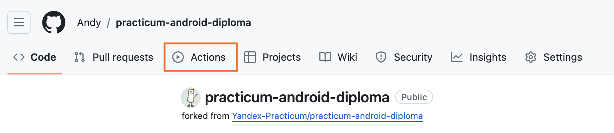
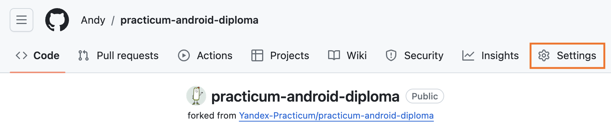
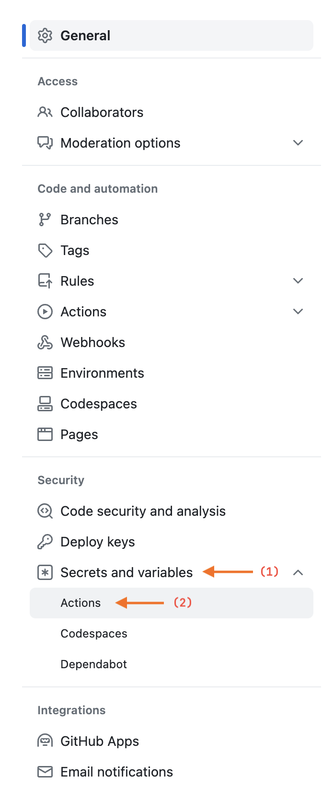
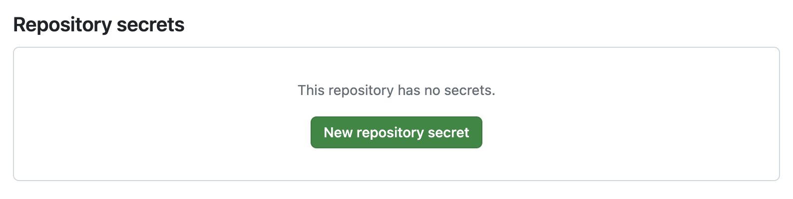
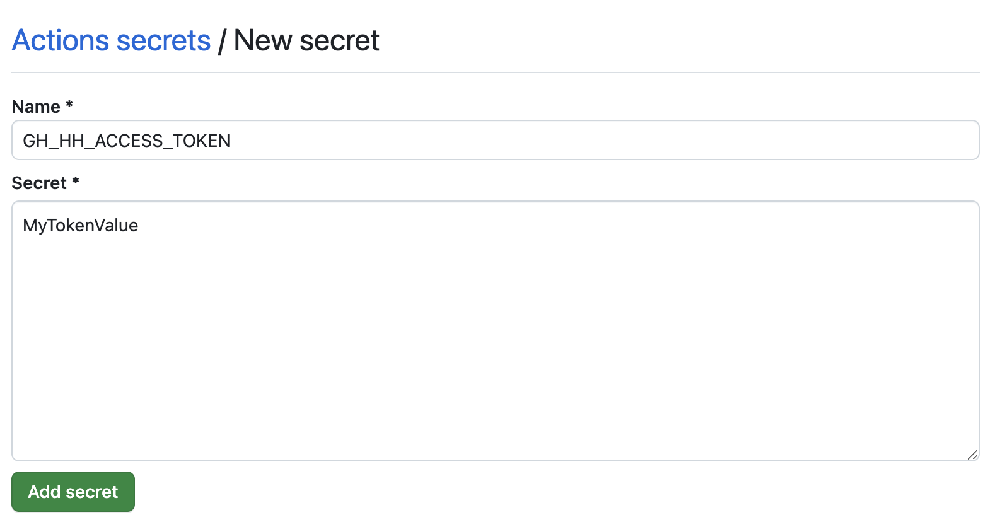
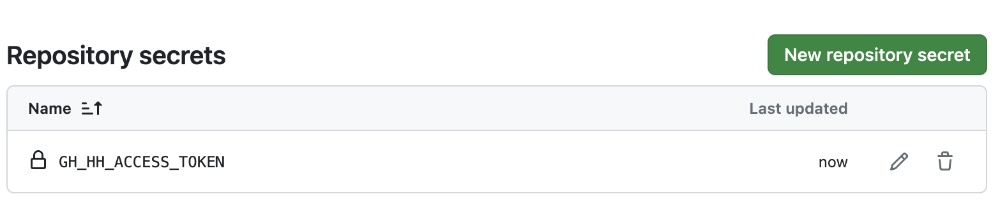

# Дипломный проект Яндекс.Практикума по курсу "Android-разработчик"

Проект представляет собой стартовую точку для разработки дипломного проекта Яндекс.Практикума по
курсу ["Android-разработчик"](https://practicum.yandex.ru/android-developer/).

# Предварительная настройка проекта

## Добавление секретного токена для API HeadHunter

Для проброса секретного токена, полученных после регистрации приложения для использования API HeadHunter, создайте в
корне проекта файл `develop.properties` и добавьте туда одно свойство:

```properties
hhAccessToken=my_access_token
```

Вместо `my_access_token` вставьте полученный после регистрации токен доступа к API HeadHunter. После изменения значения
синхронизируйте проект.

Файл `develop.properties` игнорируется при коммитах в Git, поэтому можно не бояться, что значение токена попадёт в
открытый доступ. Значения, записанные в файл `develop.properties`, будут добавлены в приложение на стадии сборки и
попадут в специальный объект, который называется `BuildConfig`. Подробнее про этот объект можно почитать
в [документации](https://developer.android.com/build/gradle-tips#share-custom-fields-and-resource-values-with-your-app-code).

## Статический анализ

В проекте настроен базовый статический анализатор - [detekt](https://detekt.dev/).
Он проверит наличие большого количества стандартных ошибок при написании Kotlin-кода.

Конфигурационный файл detekt находится [здесь](./conf/detekt.yml). Описание смысла правил можно найти
в официальной документации detekt - [например, вот правила группы `comments`](https://detekt.dev/docs/rules/comments).

Чтобы проверить наличие ошибок detekt в проекте, откройте терминал и выполните команду `./gradlew detektAll`. После
выполнения в выводе терминала вы увидите список ошибок, если они у вас есть, рядом с каждой ошибкой будет находиться
ссылка на кусочек кода, где detekt обнаружил ошибку.

Также в проекте настроена команда, которая исправляет большое количество ошибок форматирования detekt. Чтобы запустить
её, откройте терминал и выполните команду `./gradlew detektFormat`.

## Настройка Github Actions

В дипломном проекте используется сервис [Github Actions](https://github.com/features/actions) для настройки CI (
Continuous Integration). Это позволяет автоматизировать базовые проверки качества приложения, такие как компиляция
проекта и прогон статического анализатора [detekt](https://github.com/detekt/detekt). Файл конфигурации CI вы
можете [найти здесь](./.github/workflows/pr_checks.yml).

На каждый созданный pull request CI-сервер:

- Скомпилирует проект и соберёт APK приложения, описанного в модуле `app`. Готовый APK можно скачивать на свой телефон
  или передавать на тестирование другим разработчикам или ревьюверам.
- И запустит статический анализатор `detekt`, чтобы подсветить наличие или отсутствие ошибок, которые можно обнаружить,
  не запуская приложение. В частности, это поможет вам соблюдать принятый на проекте код-стайл.

Чтобы автоматические проверки могли запускаться на каждый созданный pull request, необходимо сделать несколько
дополнительных действий:

- Активировать `Github Actions` в вашем форке дипломного проекта.
- И добавить токен API HeadHunter в секреты репозитория.

### Шаг 1 - Активация Github Actions

По умолчанию Github отключает настроенные `Github Actions` для каждого форка оригинального репозитория. Это сделано для
того, чтобы каждый разработчик и разработчица осознанно применяли описанные конфигурации CI (мало ли что настроено в
оригинальном репозитории!).

Чтобы активировать `Github Actions` в форке дипломного проекта, необходимо зайти во вкладку `Actions`:



А затем нажать на зелёную кнопку - так вы даёте своё согласие на запуск описанных в репозитории
файлов-конфигураций `Github Actions`:


### Шаг 2 - Добавление токена API HeadHunter в секреты проекта

Файл `develop.properties` не хранится в истории коммитов, однако значение токена API HeadHunter необходимо для успешной
сборки APK приложения. Чтобы CI-сервер смог получить значение токена, его нужно добавить
в [секреты репозитория для Github Actions](https://docs.github.com/ru/actions/security-guides/using-secrets-in-github-actions#creating-secrets-for-a-repository).

Откройте вкладку `Settings` с главной страницы форка:



В левой части экрана найдите раздел `Security`, в нём есть пункт `Secrets and variables` (цифра (1) на скриншоте). При
нажатии на этот пункт появится выпадающий список, в котором будет элемент списка `Actions` (цифра (2) на скриншоте).



Нажмите на этот элемент списка и в правой части экрана вы увидите блок, который называется `Repository secrets`:



Нажмите на кнопку `New repository secret`. В появившемся окне в качестве названия секрета укажите `GH_HH_ACCESS_TOKEN`,
а в качестве значения укажите тот же токен, что вы добавляли в файл `develop.properties`:



После ввода ключа и значения нажмите кнопку `Add secret`. Если вы всё сделали правильно, то вы должны увидеть
обновлённый блок `Repository secrets`:



# Техническое задание

Дипломный проект представляет собой небольшое приложение для поиска работы,
использующее [API сервиса HeadHunter](https://github.com/hhru/api). Приложение предоставляет следующую функциональность:

- Поиск вакансий;
- Указание фильтров для поиска;
- Просмотр деталей отдельной вакансии;
- И добавление вакансий в список "Избранного".

Ниже представлен список требований и особенностей различных экранов приложения, ознакомьтесь с ним до начала разработки.

## Общие требования

- Приложение должно поддерживать устройства, начиная с Android 8.0 (minSdkVersion = 26)
- Приложение поддерживает только портретную ориентацию (`portrait`), при перевороте экрана ориентация не меняется.

## Главный экран -- экран поиска вакансий

На этом экране пользователь может искать вакансии по любому непустому набору слов поискового запроса. Результаты поиска
представляют собой список, содержащий краткую информацию о вакансиях.

### Особенности экрана

Несколько особенностей экрана, которые нужно учитывать при реализации:

- По умолчанию, поиск происходит по всей доступной базе вакансий без учёта региона, отрасли компании и уровня зарплаты и
  валюты.
- Приложение не хранит историю поиска, поэтому между перезапусками приложения текст в поле ввода не обязан сохраняться.
- При вводе нового текста в поле ввода мы осуществляем новый поиск с debounce в 2000 миллисекунд.
- В отдельном элементе списка может быть картинка логотипа компании, которую нужно дополнительно загрузить. В процессе
  загрузки картинки и в случае ошибки загрузки этой картинки мы показываем плейсхолдер. Также плейсхолдер отображается,
  если информации о картинке нет.
- В зависимости от пришедших с сервера данных информация о вакансии может отображаться несколькими способами:
    - "От XX";
    - "До XX";
    - "От XX до XX";
    - "Зарплата не указана".
- Если в вакансии указана зарплата, то числа должны отображаться с разбиением на разряды (то
  есть `1 000 000`, `12 345 678`).
- Зарплата в вакансии может быть указана в разной валюте, не только в рублях. Вот полный список возможных валют:
    - Российский рубль (RUR / RUB)
    - Белорусский рубль (BYR)
    - Доллар (USD)
    - Евро (EUR)
    - Казахстанский тенге (KZT)
    - Украинская гривна (UAH)
    - Азербайджанский манат (AZN)
    - Узбекский сум (UZS)
    - Грузинский лари (GEL)
    - Киргизский сом (KGT)
- (\*) В целях экономии трафика пользователей загрузка результатов поиска должна происходить постранично (paging) по 20
  элементов за раз. Запрос на следующую страницу должен происходить, когда пользователь доскроллил до последнего
  доступного элемента списка (или чуть раньше).

## Фильтрация -- набор экранов фильтров поиска

Используя настройки фильтра, пользователь может уточнить некоторые параметры поиска, который осуществляется на экране
"Поиск". Фильтр позволяет указать:

- Место работы - регион, населённый пункт, указанный в вакансии как рабочая локация.
- Отрасль - сфера деятельности организации, разместившей вакансию.
- Уровень зарплаты - уровень ЗП, соответствующий указанному в вакансии.
- Возможность скрывать вакансии, для которых не указана ЗП.

### Особенности экранов

Несколько особенностей, которые нужно учитывать при реализации:

- Параметры фильтра не являются обязательными - пользователь может уточнить любой параметр из предложенных, а может не
  указывать ничего. В случае, если указан хотя бы один из параметров он должен учитываться при последующих поисковых
  запросах на экране "Поиск". Параметры фильтра, которые пользователь не уточнял, в поисковом запросе участвовать не
  должны.
- Настройки параметров фильтра должны сохраняться даже после закрытия приложения.
- Поиск по отраслям компании ведётся сразу по всем элементам дерева отраслей, без разделения на категории по уровням
  вложенности.
- Экраны фильтрации отображаются поверх нижней навигации.
- Если у пользователя выбрана страна поиска вакансий, то список регионов на экране выбора региона поиска
  ограничивается регионами указанной страны.
- Если пользователь выбрал город до выбора страны, то страна должна подставляться автоматически.
- Кнопка "Сбросить" появляется, если пользователь указал хотя бы одно значение фильтров.
- Кнопка "Применить" появляется, если пользователь указал фильтр, отличающийся от предыдущего.
  Нажатие на кнопку "Применить" приводит к сохранению выбранных настроек фильтра и применению фильтра для всех
  последующих запросов на поиск вакансий до изменения фильтра.
- Все настройки фильтра сохраняются автоматически сразу после изменения.

## Экран просмотра деталей вакансии

Нажав на элемент списка найденных вакансий (а так же в списке закладок и похожих вакансий), пользователь попадает на
экран с подробным описанием вакансии. Помимо уровня ЗП, требуемого опыта и графика работы пользователь может на этом
экране увидеть:

- Информацию о работодателе
- Подробное описание вакансии
- Перечень требуемых ключевых навыков
- Контактную информацию

Также пользователь может ознакомиться со списком похожих вакансий, поделиться ссылкой на данную вакансию, а также
связаться с работодателем через указанные контакты.

### Особенности экрана

Несколько особенностей экрана, которые нужно учитывать при реализации:

- Любая часть описания деталей вакансии опциональна, то есть из сети может не прийти какое-то из ожидаемых полей. В этом
  случае программа должна корректно работать и отображать те данные, которые у неё есть.
- Подробное описание вакансии приходит в HTML-формате, напрямую отобразить полученное по сети поле не получится.
- При нажатии на элемент списка похожих вакансий требуется открыть новый экран деталей вакансий, который связан с
  предыдущим (на предыдущий экран можно вернуться, нажав кнопку `Back`).
- Отображение указанной зарплаты и валюты должно происходить аналогично выдаче поиска вакансий.
- При нажатии на указанный адрес электронной почты должен открываться диалог с предложением написать email на этот
  адрес.
- При нажатии на указанный номер телефона приложение должно открыть приложение для звонка, в котором уже будет отображён
  номер телефона.
- Отображение списка похожих вакансий должно происходить аналогично отображению списка вакансий на экране поиска.
- Экраны деталей вакансии отображаются поверх нижней навигации.

## Экран избранных вакансий

Пользователь может добавлять вакансии в "Избранное", чтобы иметь возможность быстро вернуться к заинтересовавшему его
предложению. Добавить вакансию в "избранное" (или удалить из "избранного") можно на экране "Вакансия". На экране списка
избранных вакансий пользователь может удалить вакансию из закладок. Все вакансии, добавленные в закладки, можно увидеть
на отдельном экране в приложении.

### Особенности экрана

Несколько особенностей экрана, которые нужно учитывать при реализации:

- Вакансии, добавленные в "избранное" можно просматривать без подключения к интернету. Если нет интернета, вместо
  логотипа компании можно показывать плейсхолдер и не отображать список похожих вакансий.
- Если пользователь добавляет вакансию в закладки, она должна сразу появиться на экране списка закладок.
- (\*) Список избранных вакансий может содержать довольно много вакансий, поэтому для ускорения загрузки экрана можно
  добавить пагинацию для выдачи избранных вакансий.

## Экран информации о команде разработчиков

На экране отображается статический список людей, участвовавших в разработке приложения. 
